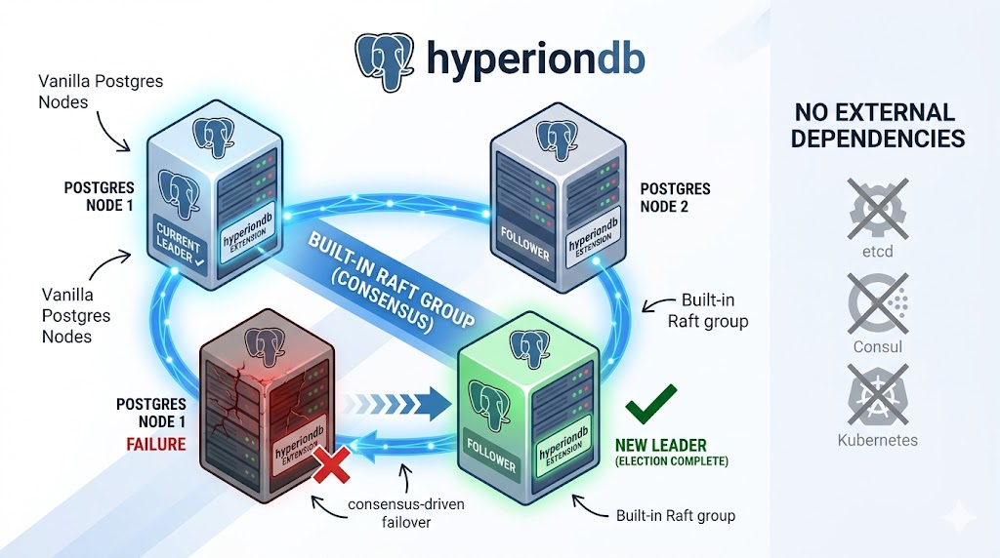

# HyperionDb

[](https://github.com/weidoapp/hyperiondb)

A PostgreSQL extension that gives a small cluster of **vanilla Postgres** nodes
**automatic, consensus-driven failover** — full-cluster replication (tables,
roles, DDL, *everything*) with a **built-in Raft group** and **no external
dependencies**: no etcd, no Consul, no Kubernetes.

Replaces Patroni, CloudNativePG, pgActive and many more.

One job: keep a single leader elected and the data byte-identical across N nodes,
and fail over automatically when the leader dies. Do that one job well.

---

## The one idea

**Don't reinvent replication.** Postgres already ships **physical (WAL) streaming
replication**, which copies *everything* byte-for-byte — heap, indexes, and the
**shared catalog `pg_authid`** (i.e. roles/users and their SCRAM verifiers).
That is exactly why physical replicas have the same roles as the primary, while
logical replication / active-active (pgactive) do not.

`pg_replica` adds the *only* piece Postgres itself lacks: **automatic leader
election and failover**, using an **embedded Raft quorum** instead of an external
DCS.

| Plane | Who does it |
|-------|-------------|
| **Data** (tables, indexes, roles, DDL) | Postgres streaming replication — untouched, battle-tested |
| **Leadership & failover** | Embedded Raft, running inside a Postgres background worker |
| **Process lifecycle** (start/restart Postgres) | Your existing supervisor — systemd or Docker restart policy |

Result: roles, DDL, and data stay consistent on every node, and a dead primary
is replaced in seconds — with no human, no etcd, no Kubernetes.

---

## Test

```bash
# Build dependencies

sudo apt-get update
sudo apt-get install -y \
  build-essential pkg-config libssl-dev \
  libreadline-dev zlib1g-dev flex bison \
  libxml2-dev libxslt-dev libxml2-utils xsltproc \
  ccache libclang-dev clang \
  iptables libfaketime
curl --proto '=https' --tlsv1.2 -sSf https://sh.rustup.rs | sh -s -- -y
source "$HOME/.cargo/env"
rustup default stable
rustc --version

# test dependencies
cargo install --locked cargo-pgrx --version 0.18.1
cargo pgrx init
cd packages/pg_replica
cargo pgrx run pg18

CREATE EXTENSION pg_replica;
```

### Run the whole test suite

One command builds the extension + test clients and runs every test (3-node
clusters in `/tmp`, torn down between each):

```bash
bash scripts/run-all-tests.sh            # build, then run all tests + summary
bash scripts/run-all-tests.sh --no-build # skip the rebuild
```

Coverage (`scripts/test-*.sh`, each spins a real 3-node cluster):

| Test | Proves |
|------|--------|
| `test-m3-lsn` | failover promotes the **highest-LSN** survivor (no data loss) |
| `test-m4-fence` | minority primary **self-demotes** read-only (no split-brain) |
| `test-m4-watchdog` | a **hung** control plane is fenced by the deadman watchdog |
| `test-m4-partition` | a **network-partitioned** (but running) primary self-demotes |
| `test-m5-rejoin` | deposed primary `pg_rewind`-rejoins as a standby |
| `test-m5-walgone` | WAL gone → automatic **`pg_basebackup` re-clone** |
| `test-compaction` | Raft log stays **bounded** via snapshotting |
| `test-m6-routing` | a multi-host client **follows the failover** with only a reconnect |
| `test-m7-sync` | quorum-sync = **zero committed-transaction loss** on failover |
| `test-chaos` | Jepsen-style: continuous writer under partitions / SIGSTOP / kill / clock-skew / slow-disk / rolling-restart — **0 split-brain**, converges, zero-loss for clean failovers |

---

## Goals / non-goals

**Goals**
- Automatic failover on a 3- or 5-node cluster (Raft majority quorum).
- Full-cluster fidelity: roles, GRANTs, DDL, extensions, data — all replicated
  (free, via physical replication).
- Zero external coordination services (Raft is embedded).
- Lightweight: one `.so` extension + Postgres; no JVM, no Go control plane, no k8s.
- Safe by default: quorum-gated, fences the old primary, picks the most-advanced
  replica, rejoins the loser with `pg_rewind`.
- Operable from SQL: `SELECT pg_replica.status();`, `pg_replica.failover()`, etc.

**Non-goals**
- Sharding / horizontal write scale-out → that is Citus, a different axis.
- Connection pooling / proxy → recommend HAProxy or libpq multi-host
  (`target_session_attrs=read-write`). pg_replica only *publishes* who the primary is.
- Backups / PITR → recommend pgBackRest or wal-g.
- Logical / multi-master replication → out of scope by design.

---

## Positioning (honest prior art)

| Tool | Consensus | External deps | Form factor |
|------|-----------|---------------|-------------|
| **CloudNativePG** | k8s control plane | **Kubernetes required** | operator |
| **Patroni** | etcd/Consul/k8s — *or* `pysyncobj` Raft mode | DCS (or its raft lib) | Python agent |
| **pg_auto_failover** | single **monitor** node (not quorum) | a monitor Postgres | C ext + agent |
| **Stolon** | external store (etcd/consul) | DCS | Go agents |
| **repmgr** | none (manual/assisted) | — | C ext + CLI |
| **pg_replica** (this) | **embedded Raft quorum** | **none** | **Postgres extension** |

The niche: embedded quorum (unlike pg_auto_failover's single monitor), **no
external DCS** (unlike Patroni-etcd / Stolon), **no Kubernetes** (unlike CNPG),
shipped as a plain Postgres extension. Closest existing thing is Patroni's
`raft` DCS mode — pg_replica aims to be that idea, but native, in-process, and Rust-light.

---

## Status

**Design / planning.** No code yet. Start with:
- [docs/ARCHITECTURE.md](docs/ARCHITECTURE.md) — components, failover flow, fencing, the hard problems.
- [docs/DECISIONS.md](docs/DECISIONS.md) — the load-bearing design choices and why.
- [docs/TODO.md](docs/TODO.md) — phased milestones
- [docs/CLIENT_TODO.md](docs/CLIENT_TODO.md) — phased milestones for nodejs addon
